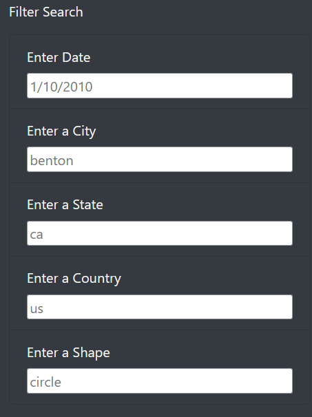
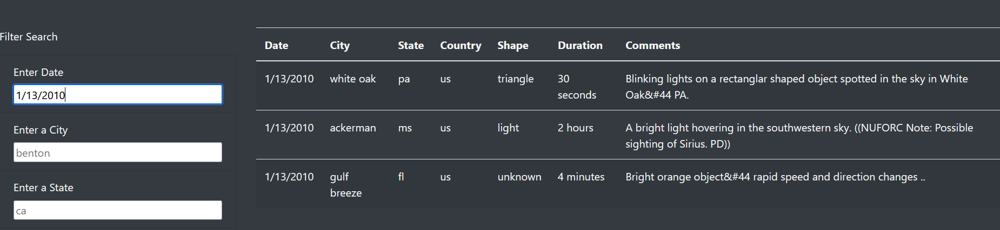
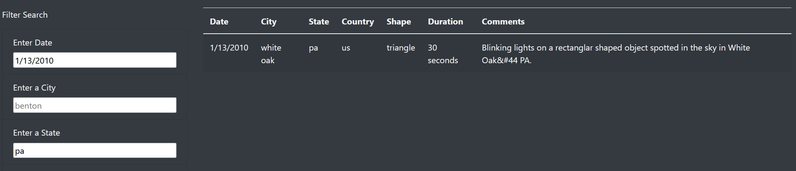

# The Truth is Out There

## Overview
We used JavaScript, CSS, and HTML to create a webpage to display reports of UFO (Unidentified Flying Objects) sightings, with a table of data that can be filtered by date, city, state, country, or the shape of the spotted object.  

## Filtering Results

The filter appears as a series of input boxes as shown above, where a user can type their search criteria.  The text boxes have placeholder values to demonstrate formatting, such as a date of 1/10/2010.  All a user has to do is type their criteria in the appropriate box or boxes, and the table of data will update to show only the matching values.

Above is an example of the table after being filtered by date for 1/13/2010.  The user input is darker than the placeholder values, so it's easy to tell what is actually being used.  For this date, only three values are showing, out of over 100 on the full table.  We can further filter our results by inputting 'pa' as the state, to get the single result shown below.

## Summary
This webpage is functional, and works well to convey the data we meant for it to, but the table is obnoxiously long.  It would be nice to add a scrollbar to the table, so you can't scroll so far past the filters.  This problem will only grow as more UFO sightings are added to the list.  Additionally, it may be nice to filter by a range of dates, like if someone wanted every sighting from the first week in January, rather than having to go day by day.  Another search feature we could incorporate would be a sort of key-word filter, where people could input text and find sightings with those words in the description.  For example, I see several entries mentioning seeing 3 red lights, and it may be nice to be able to search for all similar events.
